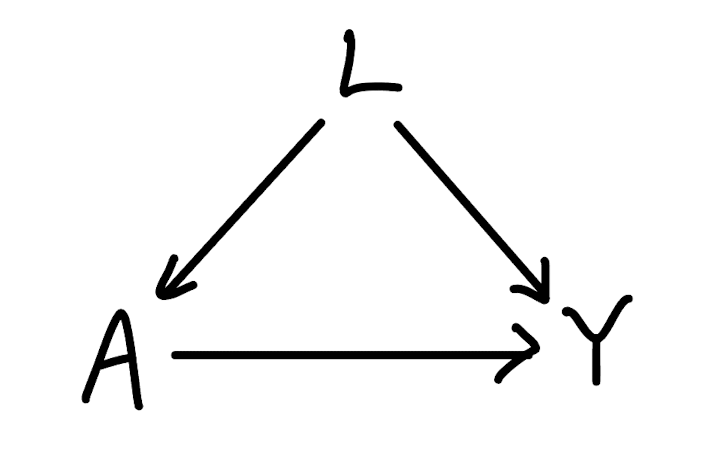

```{r setup, include=FALSE}
knitr::opts_chunk$set(echo = T, message = F, warning = F)

# libraries
library(tidyverse)
library(ggplot2)
library(knitr)
library(perm)
library(ri)

# setup plot theme
theme_set(
  theme_bw() +
    theme(legend.position = "top")
  )
```

# Question 1
(1) We know all the potential outcomes, so the causal effect of the treatment for an individual can be calculated by $Y_1-Y_0$ ($Y_1$: the potential outcome of a disease if an individual is assigned new treatment, $Y_0$: the potential outcome of a disease if an individual is assigned standard treatment). The average causal effect is $E[Y_1-Y_0]=$ `r 6/20`. On average, the new treatment prevents disease in 30% more individuals compared to the standard treatment.

(2) Under consistency, SUTVA, randomizeation and positivity assumption, $ACE=E[Y_1 - Y_0] = E[Y_1 \mid A = 1] - E[Y_0 \mid A = 0]=E[Y \mid A = 1] - E[Y \mid A = 0]$  
Given the table, $E[Y \mid A = 1]=\frac{1+0+1+0+0+0+0+1+1+0}{10}=0.4$ and $E[Y \mid A = 0]=\frac{0+0+1+0+0+0+0+1+0+0}{10}=0.2$. So $ACE=0.4-0.2=0.2$.   
This suggest that the new treatment has 20% higher likelihood of disease prevention compared to standard treatment. 

(3) The observed effect in (2) is smaller than in (1). The counterfactuals in (2) are unknown, and knowing (1), it appears that some individuals who would have shown a preventive effect with the new treatment were assigned to the standard treatment group in (2). This potentially attenuates the effect observed in (2).

(4) 
(a) Observational study   
In an observational study, the intervention is not assigned randomly and the exposure is likely to be influenced by various factors. Moreover, we may observe different number of individuals in each exposure groups by the nature of the data collection process. This can leads to a biased estimates of the outcome effect.  

(b) Randomized controlled trial  
In RCT, the randomization of treatment (intervention) assignment leads to expected balance on both observed and unobserved covariates in each group. This can minimize confounding and allows for an unbiased estimate of treatment effect under the necessary assumptions. 

(5) Given the data, we can rule out the crossover trial because each individual receive only one of the treatment.  

(6) Knowing the true potential outcomes under both treatments, I first divide the participants into three groups, G=1, G=2, and G=3, with G=1 being individuals whose outcomes are not affected by treatment assignment, G=2 being individuals whose outcomes are positively affected by the new treatment, and G=3 being individuals whose outcomes are negatively affected by the new treatment. I then use R to randomize the treatment within each group based on the complete randomization method, with the size of the new treatment group equal to the standard treatment. Below is a table showing the results of this assignment mechanism.  

```{r echo=F}
df <- data.frame(
  Individual = 1:20,
  G = c(2, 1, 2, 1, 1, 1, 2, 1, 2, 1, 3, 1, 1, 1, 2, 3, 2, 2, 1, 2)
)

# function to assign random A=1 and A=0 within each group
set.seed(123)
assign_treatment <- function(data) {
  # number of individuals in the group
  n <- nrow(data)
  
  # generate equal number of 1s and 0s
  treatment <- sample(c(rep(1, n/2), rep(0, n/2)))
  
  # return the treatment assignment
  return(treatment)
}

# apply the function within each group
set.seed(123)
df$A <- ave(df$G, df$G, FUN = function(x) assign_treatment(df[df$G == x[1], ]))

# add observed outcome Y
df <- df |> 
  mutate(
    Y = c(1,0,1,0,1,0,0,0,0,0,0,0,0,1,0,1,1,0,0,1)
  )

df <- df |> 
  select(-G, G)

kable(df)
```

(7) 
```{r}
# set up the data frame based on the table
df <- data.frame(
  Individual = 1:20,
  A = c(1, 1, 1, 0, 1, 0, 0, 0, 0, 0, 1, 1, 0, 1, 0, 0, 1, 0, 1, 1),
  Y = c(1, 0, 1, 0, 1, 0, 0, 0, 0, 0, 0, 0, 0, 1, 0, 1, 1, 0, 0, 1),
  G = c(2, 1, 2, 1, 1, 1, 2, 1, 2, 1, 3, 1, 1, 1, 2, 3, 2, 2, 1, 2)
)

Yb_obs1 = df |>
  filter(A == 1) |>
  summarize(mean_Y_obs = mean(Y)) |>
  pull(mean_Y_obs)
Yb_obs0 = df |>
  filter(A == 0) |>
  summarize(mean_Y_obs = mean(Y)) |>
  pull(mean_Y_obs)

# calculate t_obs
T_obs = Yb_obs1 - Yb_obs0

# possible number of treatment assignment
A_num = choose(10, 5)*choose(8, 4)*choose(2, 1)

# record possible treatment assignment in each blosck as a matrix
g1 = chooseMatrix(10,5)
g2 = chooseMatrix(8,4)
g3 = chooseMatrix(2,1)

# create a function to generate the combinations
gen_comb <- function(g1, g2, g3) {
  # Get the number of rows for each matrix
  num_rows_g1 <- nrow(g1)
  num_rows_g2 <- nrow(g2)
  num_rows_g3 <- nrow(g3)
  
  # initialize an empty matrix to store results
  result <- matrix(nrow = 0, ncol = ncol(g1) + ncol(g2) + ncol(g3))
  
  # loop through all rows of g1, g2, and g3
  for (i in 1:num_rows_g1) {
    for (j in 1:num_rows_g2) {
      for (k in 1:num_rows_g3) {
        # concatenate rows from g1, g2, and g3
        new_row <- c(g1[i, ], g2[j, ], g3[k, ])
        # append the new row to the result matrix
        result <- rbind(result, new_row)
      }
    }
  }
  return(result)
}

# call the function to generate the matrix
A <- gen_comb(g1, g2, g3)

# create a placeholder for the reordered matrix based on the table for individual 1-20
new_A <- matrix(nrow = nrow(A), ncol = length(df$G))

# loop through df$G and assign the columns in the desired order
g1_cols <- 1:10      # columns for g=1
g2_cols <- 11:18     # columns for g=2
g3_cols <- 19:20     # columns for g=3

for (i in 1:length(df$G)) {
  if (df$G[i] == 1) {
    new_A[, i] <- A[, g1_cols[1]]  # take the first column for g=1
    g1_cols <- g1_cols[-1]         # remove the used column from g1
  } else if (df$G[i] == 2) {
    new_A[, i] <- A[, g2_cols[1]]  # take the first column for g=2
    g2_cols <- g2_cols[-1]         # remove the used column from g2
  } else if (df$G[i] == 3) {
    new_A[, i] <- A[, g3_cols[1]]  # take the first column for g=3
    g3_cols <- g3_cols[-1]         # remove the used column from g3
  }
}
```
- Number of individuals in A=1 group: $N_1=10$    
- Number of individuals in A=0 group: $N_0=10$    
- Total number of individuals: $N=20$  
- Mean of the outcome variable for A=1 group: $\bar{Y}_1^{obs}=$ `r round(Yb_obs1,2)`   
- Mean of the outcome variable for A=0 group: $\bar{Y}_0^{obs}=$ `r round(Yb_obs0,2)`   
- $T_{obs}=\bar{Y}_1^{\text{obs}} - \bar{Y}_0^{\text{obs}}=$ `r round(T_obs,2)`

Under the assignment mechanism in (6), there are $\binom{10}{5}\times \binom{8}{4}\times \binom{2}{1}=$ `r format(A_num, scientific = FALSE)` possibilities for $A$.

The sharp null hypothesis:  
$H_0: Y_i^1 = Y_i^0 \quad \text{for all } i$  
where $Y_i^1$ is the potential outcome for individual $i$ if they are assigned to $A=1$, and $Y_i^0$ is the potential outcome for individual $i$ if they are assigned to $A=0$.
```{r}
# create df that has the group assignment based on the first row of matrix A
df2 = df 
df2$A = new_A[1,]  

# calculate t under the first possibility of A, under the sharp null hypothesis
T_stat = mean(df2$Y[df2$A == 1]) - mean(df2$Y[df2$A == 0])
```
Under the sharp null hypothesis, the test statistic under the first row of matrix `new_A` is `r round(T_stat,2)`.

I will iterate this process for all the possibilities of matrix `new_A` to obtain the exact randomization distribution for T under the sharp null hypothesis.  
```{r}
# set up df to store T statistic values
rdist = rep(NA, times = A_num)

# iteration
for (i in 1:A_num) {
  df_ite = df2
  df_ite$A = new_A[i,]
  rdist[i] = mean(df_ite$Y[df_ite$A == 1]) - mean(df_ite$Y[df_ite$A == 0])
}
```

The $T_{obs}$ is the red line in the plot.
```{r}
# plot histogram
ggplot(data.frame(t_stat = rdist), aes(x = t_stat)) +
  geom_histogram(binwidth = 0.2, color = "black", fill = "lightblue") +
  geom_vline(aes(xintercept = T_obs), color = "red", size = 0.5) + # add T_obs line
  labs(title = "Histogram of T Statistics", x = "T Statistic", y = "Frequency")
```

Based on this distribution, we can obtain the exact p-value by the following formula:  
$P(T(A, Y) \geq T_{obs} | Y_i^1-Y_i^0 = 0) = \frac{\sum I(T(A, Y) \geq T_{obs})}{K}$ where $K = \binom{10}{5}\times \binom{8}{4}\times \binom{2}{1}$.
```{r}
# calculate the exact p-value
p_val = sum(rdist >= T_obs) / length(rdist)
```
The exact p-value is `r format(p_val, scientific = FALSE)`.

Under $\alpha=0.10$, the exact p-value < 0.10 suggests that the observed test statistic is unlikely to have occurred under the sharp null hypothesis. Therefore, we reject the null hypothesis. We can conclude that the new treatment compared to standard treatment has a causal effect on disease prevention.

(8) To calculate 90% CI, I will first set the grid as follows:
```{r}
grid = seq(-0.8, 0.8, by = 0.05)
```

Next, I will generate the randomization distribution for each hypothesized treatment effect.
```{r}
p.ci = rep(NA, length(grid)) # initialize p-value vector
rdist = rep(NA, times = A_num) # initialize rdist for number of permutations

for (i in 1:length(grid)) {
  for (k in 1:A_num) {
    A_tilde <- new_A[k,] # get treatment assignment from new_A
    rdist[k] <- mean(df$Y[A_tilde == 1]) - mean(df$Y[A_tilde == 0]) + grid[i]
  }
  p.ci[i] <- mean(rdist >= T_stat)  # calculate p-value for each hypothesized τ
}

cbind(p.ci,grid)
```
Given the output, the point estimate is the value with the highest p-value under the null. Therefore it is 0.60. 
Now, let's calculate the 90% CI.
```{r}
prob <- rep(mean(df$A), length(df$A))  # probability of treatment assignment
perms <- t(new_A)  # transpose to get N-by-r matrix

# calculate the 90% confidence interval
ci_lower <- invert.ci(df$Y, df$A, prob, perms, 0.05)  
ci_upper <- invert.ci(df$Y, df$A, prob, perms, 0.95) 
```

90% CI: (`r round(ci_lower,2)`, `r round(ci_upper,2)`)  
The non-zero positive point estimate 0.60 indicates that the observed data suggests a positive effect of the new treatment compared to the standard one. The 90% CI does not include 0, suggesting that we can reject the sharp null hypothesis at the 90% confidence level. 

(9) First, I will calculate point estimate (SACE) and variance of the estimator.
```{r}
Yb_obs1 <- mean(df$Y[df$A == 1])  # mean outcome for treatment group
Yb_obs0 <- mean(df$Y[df$A == 0])  # mean outcome for control group

# SACE point estimate
SACE <- Yb_obs1 - Yb_obs0

# variance 
S1_sq <- var(df$Y[df$A == 1])  # new treatment group
S0_sq <- var(df$Y[df$A == 0])  # standard treatment group

N1 = 10
N0 = 10

# variance of the estimator
var_SACE = (S1_sq / N1) + (S0_sq / N0)
```

$\hat{SACE}=$ `r SACE`  
$\hat{var}(\hat{SACE})=$ `r round(var_SACE, 3)`  

Confidence intervals can be calculated by $\hat{SACE}\pm z\sqrt{\hat{var}(\hat{SACE})}$. Therefore,
```{r}
# 90% CI
z = qnorm(1 - 0.10 / 2)
ci_lower = SACE - z * sqrt(var_SACE)
ci_upper = SACE + z * sqrt(var_SACE)
```
90% CI: (`r round(ci_lower,2)`, `r round(ci_upper,2)`)   
The non-zero positive point estimate `r SACE` indicates that on average, the new treatment increases the likelihood of disease prevention by 50% compared to the standard treatment. The 90% CI does not include 0, suggesting that we can reject the null hypothesis (there is no average new treatment effect) at the 90% confidence level. 

(10) 
The estimate in (1) (0.3) is lower than the estimates obtained in both (8) (0.60) and (9) (0.5). The result from (9) suggests a stronger positive effect of the new treatment compared to (1). This discrepancy may arise from the small sample size of the study, as Neyman's inference relies on the Central Limit Theorem (CLT). The result from (8) focuses more on hypothesis testing rather than precise estimation. Despite the differences, both (8) and (9) point in the same direction, indicating a positive causal effect of the new treatment, consistent with the true estimate in (1).

(11) The scientific question would be "On average, how much does the new treatment affect disease prevention compared to the standard treatment, accounting for the potential confounding factor of normal or abnormal WBC count?"

(12) 
  
A: Treatment (A = 1 new treatment, A = 0 standard treatment)  
Y: Disease prevention (Y = 1 prevented, Y = 0 not prevented)  
L: WBC count (L = 1 normal, L = 0 abnormal)  
Representation:  
$L\rightarrow A$: Individuals with normal WBC count (L = 1) are more likely to be prescribed the new treatment (A = 1)  
$L\rightarrow Y$: Individuals with normal WBC count (L = 1) are more likely to have disease prevented (Y = 1)   
$A\rightarrow Y$: The treatment (A) has a causal effect on disease prevention (Y)  

(13)
